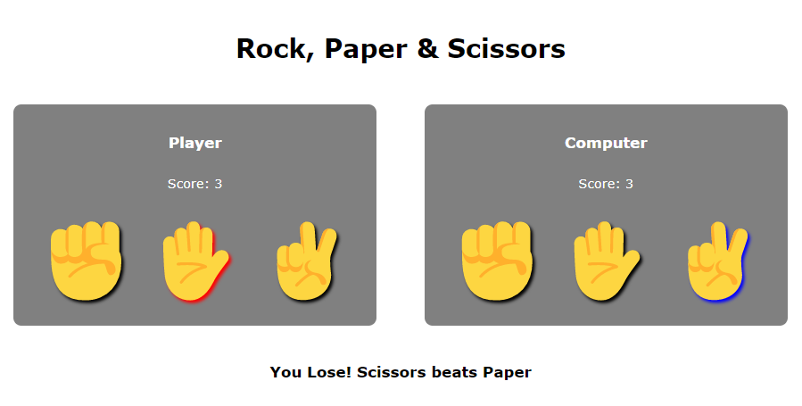

# Rock, Paper & Scissors

## About this project

With this project, I was able to learn:

- How to manipulate the DOM with Javascript
- Dynamically create new nodes
- How to attach dynamically created nodes to other nodes
- Style nodes based on user interactions
- Change node's content
